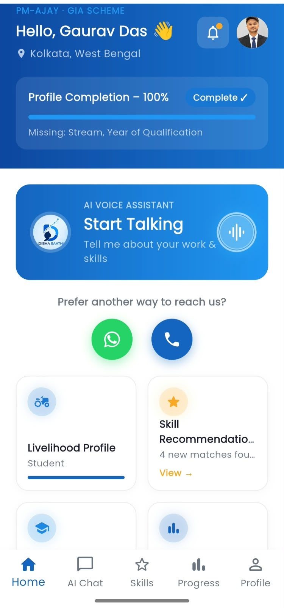
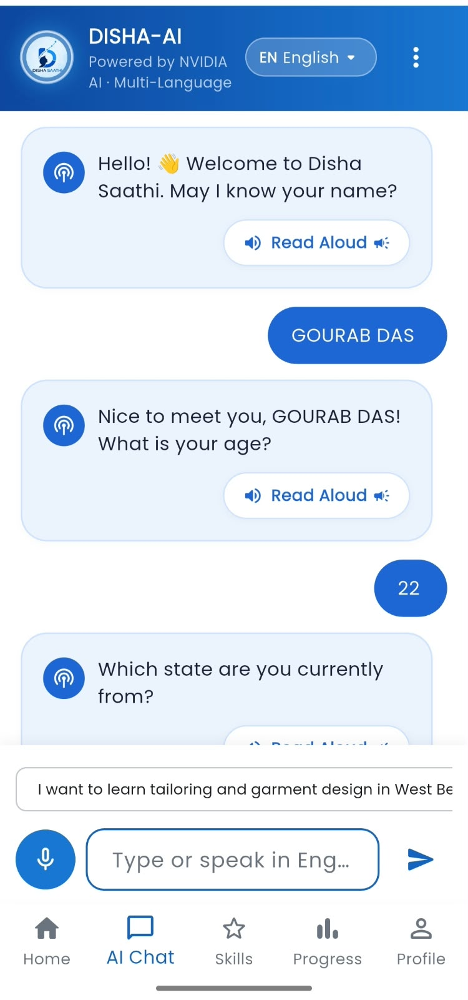
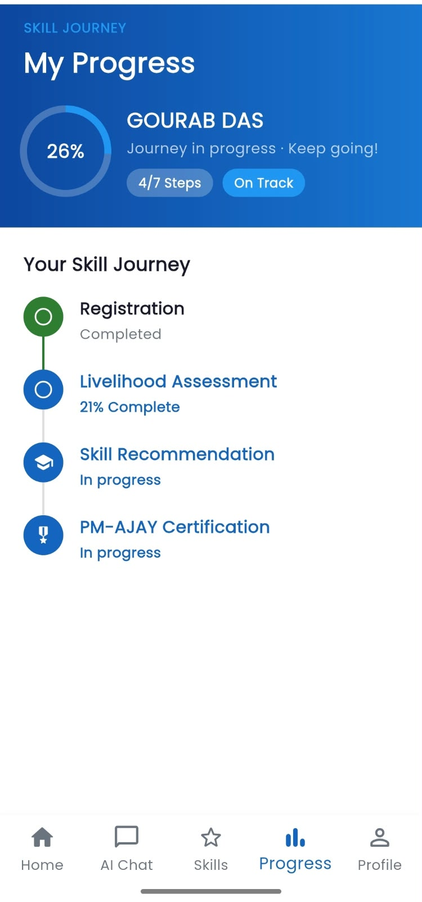
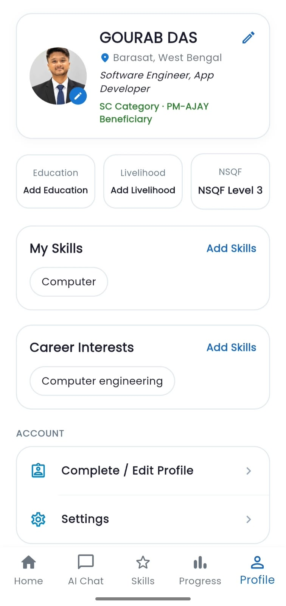
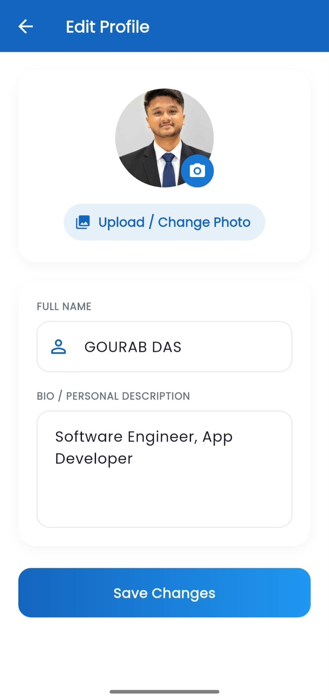
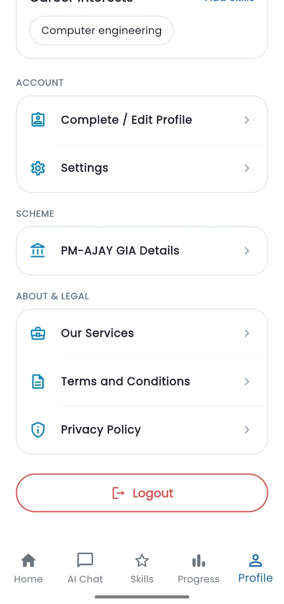
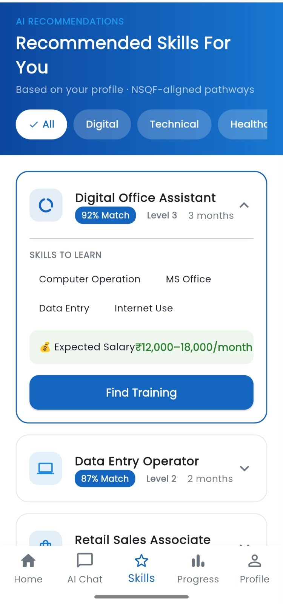

# Disha Saathi – AI-Powered Skilling & Livelihood Assistant

**Smart India Hackathon 2026 · Problem Statement 26097**
> AI-Driven Voice Assistant for Livelihood Mapping and NSQF-Aligned Skilling Recommendations for SC Communities under the GIA component of PM-AJAY  
> Team: **The AI Alchemists**

---

This is the **Flutter Frontend Client** for Disha Saathi – a voice-first, 22-language AI assistant that maps a beneficiary's livelihood, skills, and career goals, then recommends NSQF-aligned training and job pathways under the PM-AJAY GIA scheme.

---

## Tech Stack (SIH 2026 Submission Architecture)

| Layer | Technology |
|---|---|
| **Frontend** | **Flutter** (Cross-platform Web, Android, Desktop) |
| **Backend** | **Node.js + Express** (PostgreSQL REST API, Multer upload engine) |
| **AI / ML** | **NVIDIA AI / Python + FastAPI** (Multilingual NLP, STT, TTS, NSQF Matcher) |
| **Database** | **PostgreSQL** (`user_profiles`, `beneficiaries`, `chat_messages`, `otp_codes`) |
| **Authentication** | **Firebase Auth** (Google Sign-In, Mobile SMS OTP, Email OTP) |

---

## Application Screenshots & UI Flow

### 1. Onboarding, Language Selection & Authentication

| Splash Screen | Language Selection | Login / Sign-In | Registration |
|:---:|:---:|:---:|:---:|
|  |  |  |  |
| *Ministry Branding & Launch Screen* | *Supports 22 Scheduled Indian Languages + English* | *Google Sign-In, Mobile & Email OTP* | *PM-AJAY GIA Beneficiary Registration* |

<br/>

### 2. Home Dashboard & DISHA-AI Voice Assistant

| Home Dashboard | DISHA-AI Chat |
|:---:|:---:|
|  |  |
| *Auto-Detected Location & Voice Waveform Pulse Card* | *NVIDIA AI Powered Multilingual Voice & Text Assistant* |

<br/>

### 3. NSQF Training Recommendations & Progress Journey

| Skill Recommendations | Skill Progress Tracker |
|:---:|:---:|
|  |  |
| *NSQF-Aligned Skill Pathway Matches* | *7-Step Skilling & Certification Tracker* |

<br/>

### 4. Beneficiary Profile & Edit Profile Management

| Beneficiary Profile | Edit Profile & Bio | Legal & Scheme Details |
|:---:|:---:|:---:|
|  |  |  |
| *Section-Boxed Profile with SC Category Badge* | *Name, Bio & Profile Photo Upload* | *PM-AJAY Scheme & Legal Options* |

---

## Key Features & Capabilities

1. **Multilingual Voice-First Interface**:
   - Supports all **22 Scheduled Languages of India** + English (`bn`, `hi`, `pa`, `ta`, `te`, `mr`, `ur`, `gu`, `kn`, `ml`, `or`, `as`, etc.).
   - Integrated Speech-to-Text (STT) and Read Aloud Text-to-Speech (TTS).

2. **Automated Livelihood & Skill Assessment**:
   - 14-step conversational AI assessment mapping name, age, location, education, occupation, skills, experience, and career goals.
   - Dynamic profile completion calculation (0% to 100%).

3. **Official NSQF Training Matching Engine**:
   - Algorithmic matching against **2,814 official NSQF training records** from NCVET dataset.
   - Generates formatted NSQF Training Cards with Match Score %, NSQF Level, Duration, Sector, Course Code, and Awarding Body.

4. **Multi-Channel Access (App + WhatsApp + IVR)**:
   - Green WhatsApp support button with pre-filled help prompt (`Hi, I need help with Disha Saathi`).
   - Toll-free IVR phone helpline dialer launcher.

5. **PostgreSQL & Firebase Integration**:
   - Firebase Authentication with case-insensitive existing account detection (zero duplicate records).
   - PostgreSQL persistence for user profiles, chat session histories, and certificate uploads.

---

## Getting Started

### Prerequisites
- **Flutter SDK**: 3.22.0 or higher
- **Dart SDK**: 3.4.0 or higher
- **Node.js**: v18+ (for Express backend server)
- **PostgreSQL**: v14+ (or Render PostgreSQL database)

### Installation & Run Instructions

1. **Clone the repository**:
   ```bash
   git clone https://github.com/Gourabdasg/Disha-Saathi.git
   cd "Disha Saathi"
   ```

2. **Install Flutter dependencies**:
   ```bash
   flutter pub get
   ```

3. **Start the Express backend server**:
   ```bash
   cd backend
   npm install
   node server.js
   ```

4. **Run the Flutter application**:
   - **Chrome Web**:
     ```bash
     flutter run -d chrome
     ```
   - **Android Device / Emulator**:
     ```bash
     flutter run -d android
     ```

---

## Project Structure

```text
lib/
  main.dart                     # App entry point, Provider initialization
  config/api_config.dart        # Dynamic parallel API backend host resolution
  theme/app_theme.dart          # Colors, gradients, Material 3 ThemeData
  l10n/app_strings.dart         # 23-language localization dictionary
  models/app_models.dart        # UserProfile, ChatMessage, TrainingCourse, etc.
  providers/app_state.dart      # Central ChangeNotifier app state & session management
  services/
    api_service.dart            # REST API service client for Node.js Express backend
    firebase_auth_service.dart   # Firebase Auth service (Google Sign-In, Phone OTP, Email OTP)
  widgets/
    contact_icons_row.dart      # WhatsApp & IVR call helpline launcher
    gradient_button.dart        # Standard theme gradient buttons
  screens/
    splash_screen.dart          # Ministry branding launch screen
    language_selection_screen.dart # 23-language selector
    login_screen.dart           # Google Sign-In, Mobile & Email OTP authentication
    otp_verification_screen.dart # OTP verification screen
    edit_profile_screen.dart    # Name, Bio & Profile Photo upload
    main_shell.dart             # Bottom navigation shell (Home/Chat/Skills/Progress/Profile)
    home_screen.dart            # Home dashboard, voice assistant card, recent activity
    ai_chat_screen.dart         # DISHA-AI voice & text chat assistant
    recommendations_screen.dart # NSQF skill pathway recommendations
    training_screen.dart        # PM-AJAY GIA training centers & courses
    progress_screen.dart        # 7-step skill journey tracker
    profile_screen.dart         # Beneficiary profile & scheme settings
    pm_ajay_details_screen.dart # PM-AJAY GIA scheme details
```

---

## References & Official Portals

- **PM-AJAY Scheme (GIA Component)**: https://socialjustice.gov.in/schemes/104
- **National Skills Qualifications Framework (NSQF)**: https://ncvet.gov.in/national-skills-qualification-framework/nsqf-notification/
- **GitHub Repository**: https://github.com/Gourabdasg/Disha-Saathi.git
