# Disha Saathi – Flutter App

**Smart India Hackathon 2026 · Problem Statement 26097**
> AI-Driven Voice Assistant for Livelihood Mapping and NSQF-Aligned Skilling  
> Recommendations for SC Communities under the GIA component of PM-AJAY  
> Team: **The AI Alchemists**

This is the **Flutter frontend** for Disha Saathi – a voice-first, multilingual
AI assistant that maps a beneficiary's livelihood and skills, then recommends
NSQF-aligned training and job pathways.

## Tech stack (per the SIH submission)

| Layer     | Technology                     |
|-----------|---------------------------------|
| Frontend  | **Flutter** (this repo)        |
| Backend   | Node.js + Express              |
| AI / ML   | Python + FastAPI + NLP         |
| Database  | MongoDB                         |

This repo ships the complete Flutter client with all screens from the design
mockups, wired to local mock data via `provider` so the entire flow is
demoable without a live backend. Swap the mock calls in
`lib/providers/app_state.dart` for real HTTP calls to your Express API when
the backend is ready (see `backend/` and `ai-service/` stubs below).

## Screenshots

### Splash, Language & Login

| | | |
|---|---|---|
| 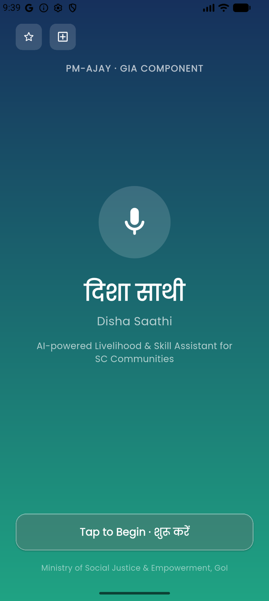 | 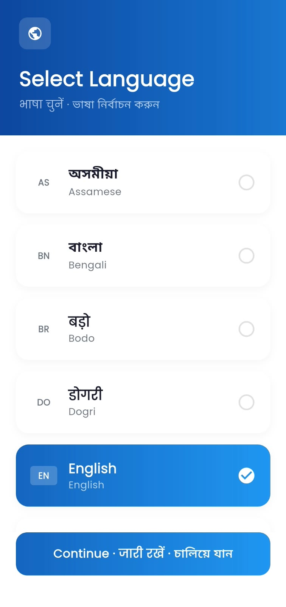 | 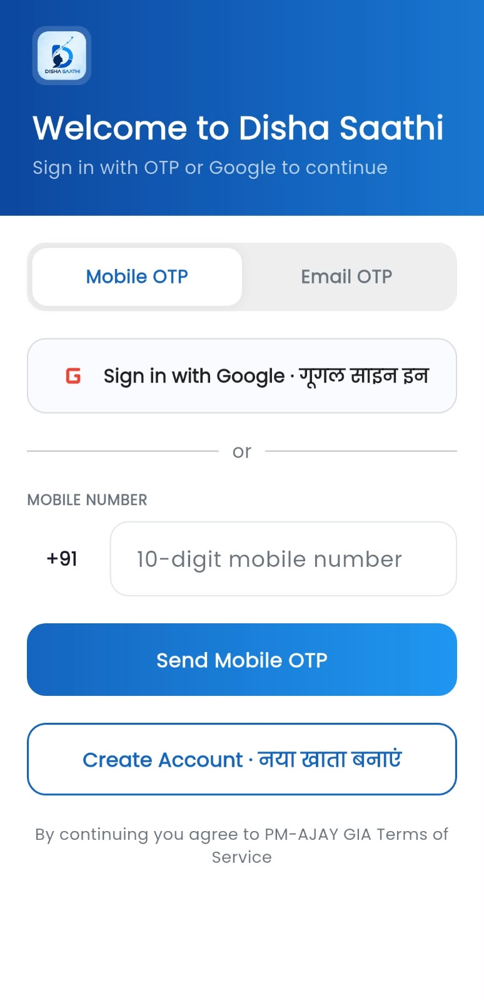 |
| Splash screen | Language selection (22 languages) | Login – Mobile/Email OTP |

### Registration

| | | |
|---|---|---|
| 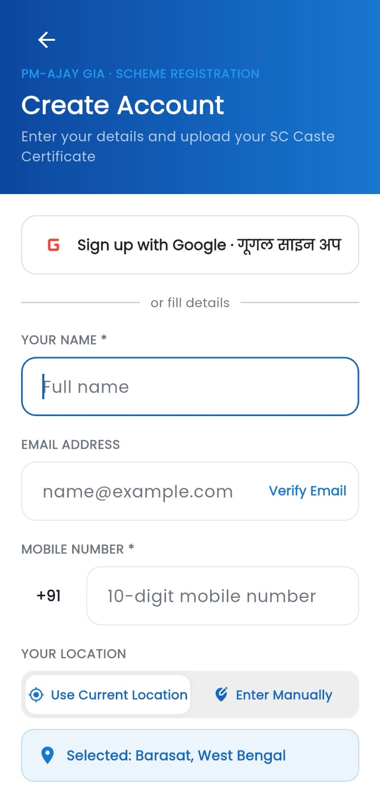 | 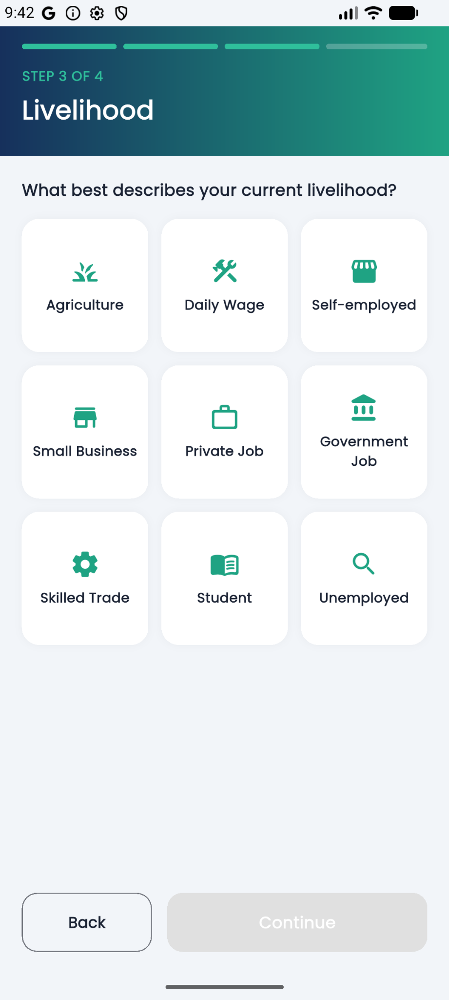 | 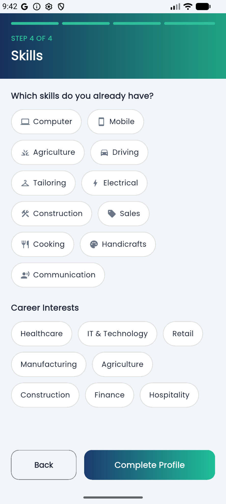 |
| Registration – Personal Info | Registration – Livelihood | Registration – Skills & Interests |

### Main App

| | | |
|---|---|---|
| 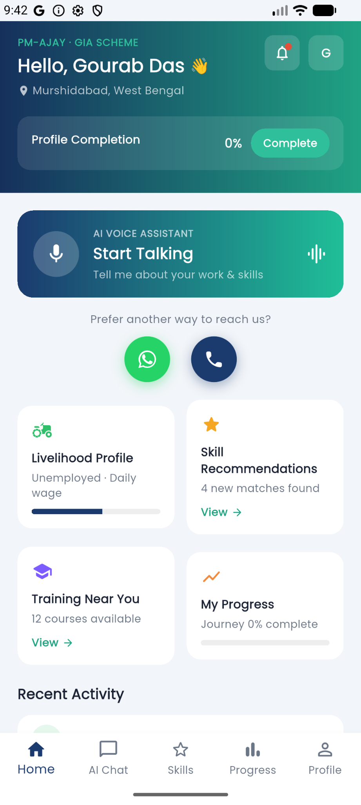 | 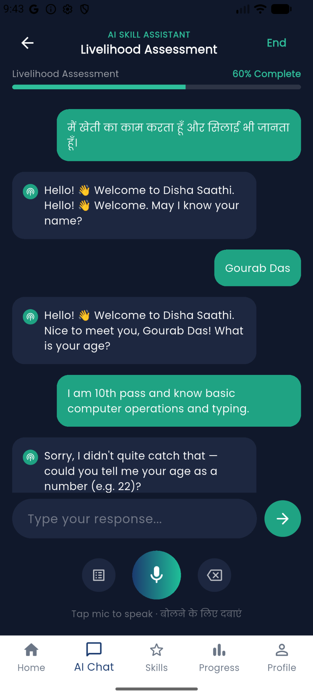 | 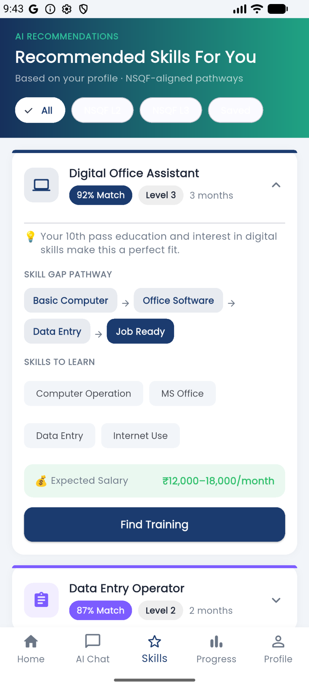 |
| Home dashboard | AI Voice/Chat livelihood assessment | AI skill recommendations – Digital Office Assistant |

### Recommendations

| | | |
|---|---|---|
| 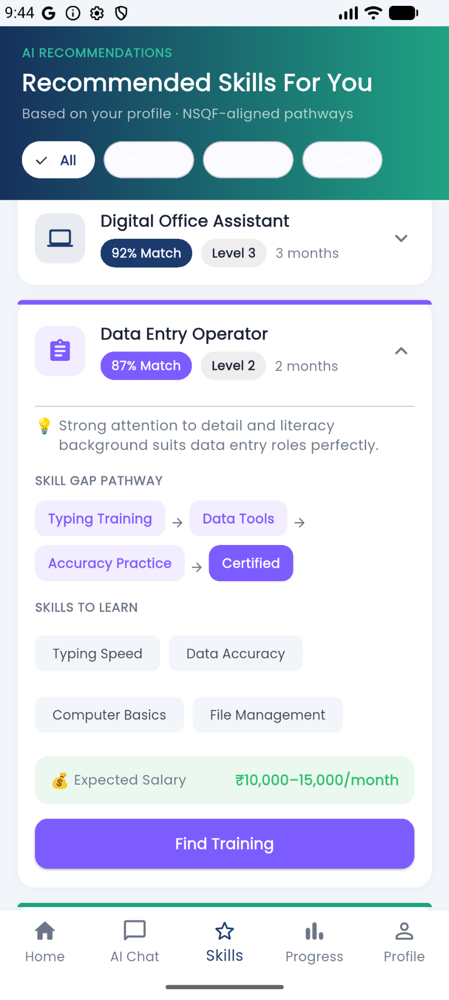 | 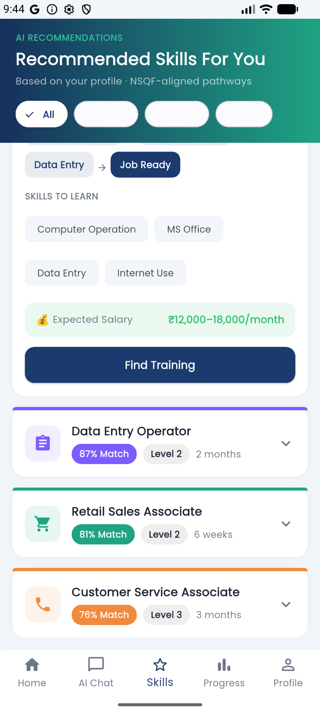 | 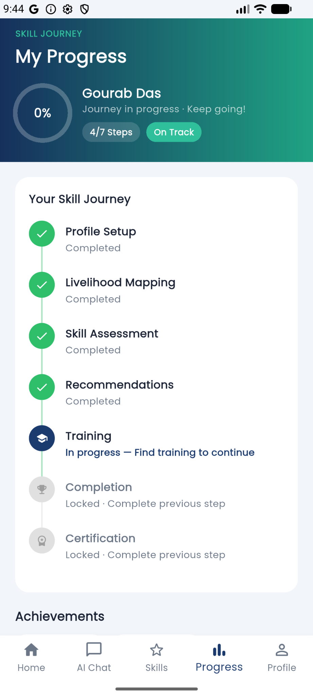 |
| Data Entry Operator recommendation | Multiple skill recommendations | My Progress – skill journey tracker |

### Achievements & Profile

| | |
|---|---|
| 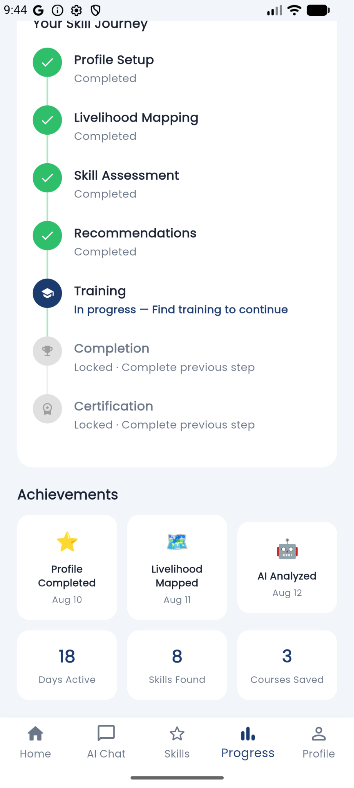 | 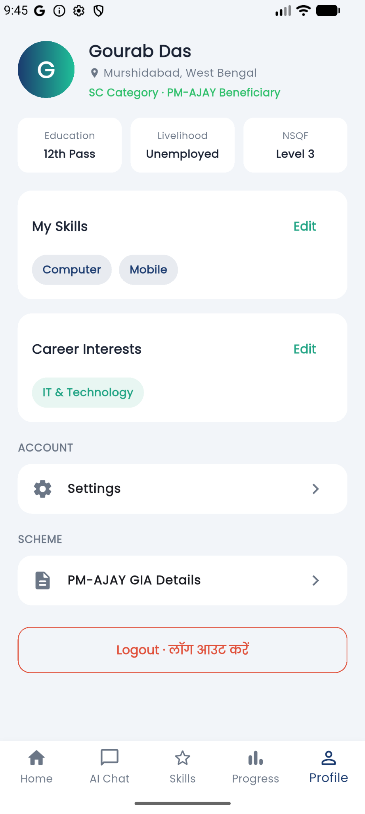 |
| Achievements & stats | Profile & career interests |

## Screens included

1. Splash (`दिशा साथी` / Disha Saathi)
2. Language selection (all 22 languages of India, plus English)
3. Onboarding carousel (3 slides)
4. Registration – 4 steps: Name → Mobile No. / Email → SC Category No. → OTP verification
5. Login – Mobile No. / Email → OTP tabs
6. OTP verification
7. Home dashboard (profile completion, voice assistant CTA, quick links)
8. AI Recommendations (NSQF match %, skill-gap pathway, expected salary)
9. Training Opportunities (filters, GIA-funded badges, apply flow)
10. My Progress (7-step skill journey tracker + achievements)
11. Notifications
12. AI Chat / Voice Assistant (livelihood assessment conversation)
13. Profile
14. Settings

## Getting started

```bash
flutter pub get
flutter run
```

Requires Flutter 3.22+ (Dart 3.x). Tested against Material 3.

### Platform folders included

- `android/` – full Gradle project (Kotlin `MainActivity`, manifest, launcher
  icons, Gradle wrapper). Open this repo root in **Android Studio** with the
  Flutter/Dart plugins installed; it will detect the project automatically.
  The first sync auto-generates `android/local.properties` with your SDK
  paths – if it doesn't, set `sdk.dir` / `flutter.sdk` there yourself.
- `web/` – runs with `flutter run -d chrome`.
- `linux/` – GTK + CMake desktop build (`flutter run -d linux`, needs GTK 3
  dev libraries on the build machine).
- `windows/` – Win32 + CMake desktop build (`flutter run -d windows`, needs
  Visual Studio with the "Desktop development with C++" workload).
- `test/` – a starter widget test (`flutter test`).

**Not included:** `ios/`, `macos/`. Both platforms' core project file
(`Runner.xcodeproj/project.pbxproj`) is an Xcode-managed indexed format
that's unsafe to hand-write – a single bad reference silently corrupts the
project – and Xcode itself only runs on macOS. Each folder has a
`PLATFORM_SETUP.md` with the one command to generate it properly on a Mac:

```bash
flutter create --platforms=ios,macos .
```

This adds the missing platform folders in place without touching your
existing `lib/`, `android/`, `web/`, `linux/`, `windows/`, or `pubspec.yaml`.

## Project structure

```text
lib/
  main.dart                     # App entry point, Provider setup
  theme/app_theme.dart          # Colors, gradients, ThemeData
  models/app_models.dart        # UserProfile, SkillRecommendation, TrainingCourse, etc.
  providers/app_state.dart      # Central ChangeNotifier app state (mock data layer)
  widgets/                      # Reusable components (buttons, chips, badges)
  screens/
    splash_screen.dart
    language_selection_screen.dart
    onboarding_screen.dart
    login_screen.dart
    otp_verification_screen.dart
    registration/               # 4-step registration flow
    main_shell.dart             # Bottom-nav shell (Home/Chat/Skills/Progress/Profile)
    home_screen.dart
    recommendations_screen.dart
    training_screen.dart
    progress_screen.dart
    notifications_screen.dart
    ai_chat_screen.dart
    profile_screen.dart
    settings_screen.dart
```

## Connecting to the real backend

Replace the mock logic in `AppState` with HTTP calls, e.g.:

```dart
final res = await http.post(
  Uri.parse('$apiBaseUrl/api/auth/otp/verify'),
  body: {'mobile': mobile, 'otp': otp},
);
```

Suggested Express endpoints:
- `POST /api/auth/otp/send`
- `POST /api/auth/otp/verify`
- `POST /api/beneficiary/profile`
- `GET /api/recommendations/:beneficiaryId`
- `GET /api/training?district=&nsqfLevel=`

Suggested FastAPI (AI/ML) endpoints:
- `POST /ai/stt` – speech-to-text (multilingual)
- `POST /ai/tts` – text-to-speech
- `POST /ai/skill-match` – NLP-based skill/interest extraction + NSQF matching

## References

- PM-AJAY (GIA component): https://socialjustice.gov.in/schemes/104
- NSQF notification: https://ncvet.gov.in/national-skills-qualification-framework/nsqf-notification/
